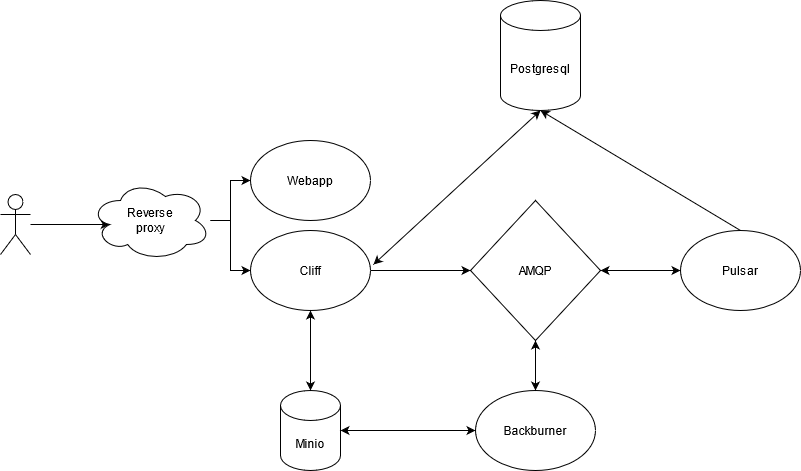

# Nienna

### Services:

#### Custom
* webapp (vue + ts) -> Allow to upload, watch video and watch livestream
* api (Go?) -> serve webapp, and deliver content
* backburner (rust) -> Process uploaded video into dash/hls
* river -> handle incoming livestream and save them

#### Tiers
* Bucket storage (minio) -> https://hub.docker.com/r/minio/minio/
* async message bus (Rabbitmq) -> https://hub.docker.com/_/rabbitmq
* Relational database (pgsql) -> https://hub.docker.com/_/postgres
* Reverse proxy (caddy) -> https://hub.docker.com/_/traefik

### TODOLIST

* send message through rabbit
* Add status route
* Do view

* Lock database when initializing database
* Do not crash when db is not ready
* Use resumable ?
* Test Cliff
* Prevent SQL injection (OMG)
* add password